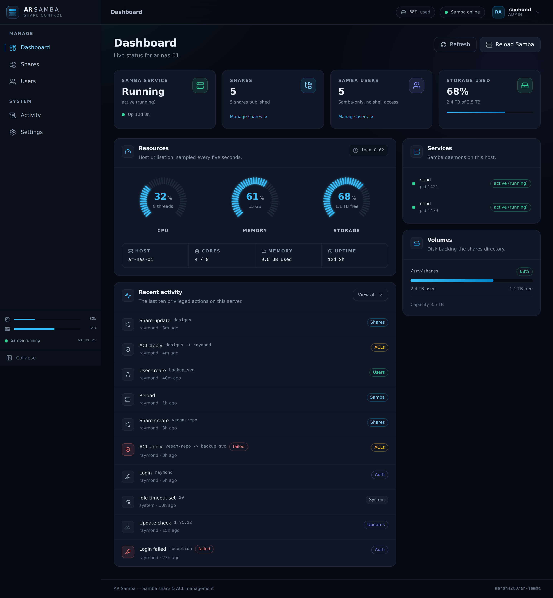
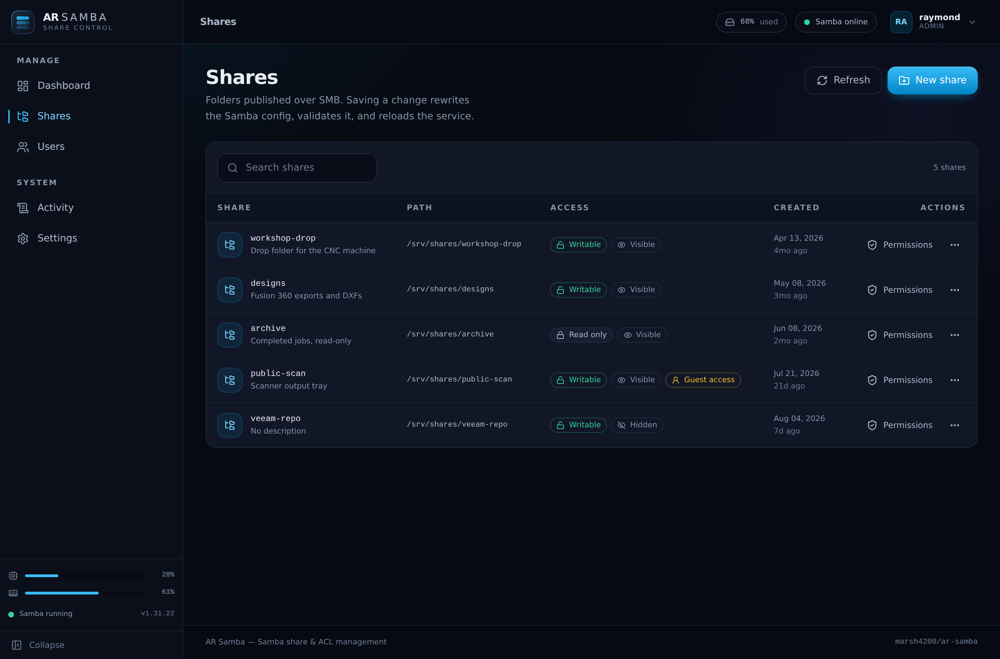
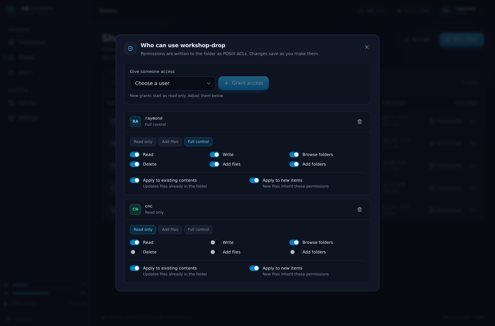
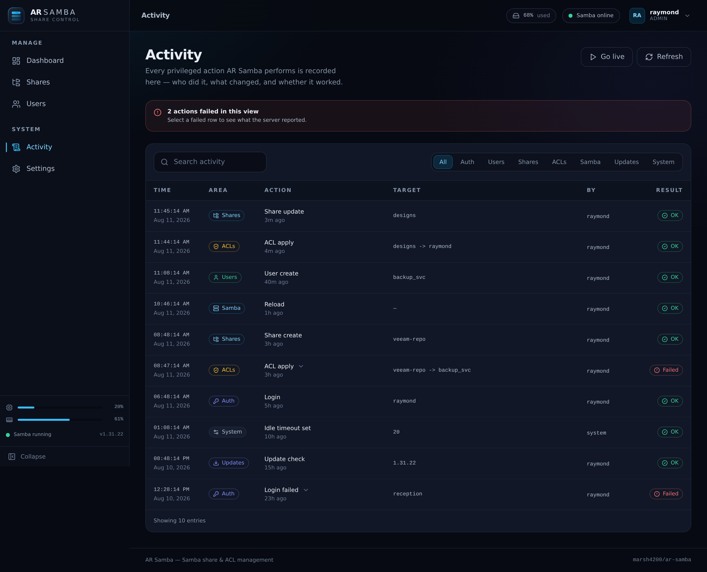

# AR Samba (ar-samba)

> Production-ready, self-hosted **Samba + ACL** management platform for Ubuntu Server.
> Manage shares, users, permissions, and `smb.conf` from a modern dark web GUI instead of editing configs by hand.


---

## ✨ Features

- 🔐 **Samba-only users** — no shell, no SSH, no desktop login (`/usr/sbin/nologin`)
- 📁 **Share management** — create, edit, delete shares with validated `smb.conf` writes
- 🛡️ **ACL editor** — `setfacl` / `getfacl` with recursive + default ACL support
- 👥 **User management** — create, disable, delete, reset password, assign shares
- 📊 **Live dashboard** — service status, storage, users, shares, recent activity
- 🔁 **Built-in updater** — pulls from GitHub, backs up, rolls back on failure
- 🐳 **Docker + systemd** — deploy either way
- 🚀 **One-line installer** for fresh Ubuntu 24.04 servers
- 🌙 **Redesigned v2.0 interface** — collapsible sidebar, live CPU/RAM/storage
  gauges, searchable tables, and a responsive layout that works on a phone
- 📈 **Live host telemetry** — CPU, memory, load and uptime via `/api/system/metrics`
- 🔑 **JWT auth** with first-run setup wizard and role-based access
- 📝 **Full activity logging** of every privileged action

---

## 📸 Screenshots

| Dashboard | Shares |
|---|---|
|  |  |

| Permissions editor | Activity log |
|---|---|
|  |  |

More, including tablet and mobile layouts, in [`screenshots/v2/`](screenshots/v2).

---

## 🚀 One-Line Install

On a fresh Ubuntu server (20.04, 22.04, or 24.04):

```bash
curl -fsSL https://raw.githubusercontent.com/marsh4200/ar-samba/main/install.sh | sudo bash
```

After install completes, open:

```
http://<your-server-ip>:9912
```

You'll be guided through the first-run setup wizard to create the admin account.

---

## 🏗️ Architecture

```
┌─────────────────────────────────────────────────────────┐
│  Browser  →  Nginx :9912  →  Frontend (React)           │
│                          ↘   Backend (FastAPI) :9913    │
│                                ↓                        │
│                          sambacontrol service user      │
│                                ↓ (restricted sudoers)   │
│                          smbpasswd / setfacl / systemctl│
│                                ↓                        │
│                          /etc/samba/smb.conf            │
│                          /etc/samba/sambacontrol.conf   │
│                          /srv/samba/shares/*            │
└─────────────────────────────────────────────────────────┘
```

The backend **never runs as root**. It runs as the `sambacontrol` system user
which is granted *only* the specific commands it needs via `/etc/sudoers.d/sambacontrol`.

---

## 📂 Project Structure

```
ar-samba/
├── backend/              FastAPI app
│   ├── app/
│   │   ├── api/          REST routers
│   │   ├── core/         config, security, db
│   │   ├── models/       SQLAlchemy models
│   │   ├── schemas/      Pydantic schemas
│   │   ├── services/     samba, acl, updater, system
│   │   └── utils/        validators, logging
│   ├── migrations/
│   ├── requirements.txt
│   └── Dockerfile
├── frontend/             React + Vite + Tailwind + shadcn/ui
│   ├── src/
│   ├── package.json
│   └── Dockerfile
├── docker/               extra compose overrides
├── nginx/                reverse-proxy config
├── installer/            sudoers, systemd units
├── scripts/              backup, restore, helpers
├── docs/                 deployment + production guides
├── .github/workflows/    CI/CD
├── docker-compose.yml
├── install.sh            one-line installer
├── update.sh             pull + rebuild + migrate
├── uninstall.sh
├── VERSION
├── LICENSE
└── README.md
```

---

## 🔧 Manual Install (without one-liner)

```bash
git clone https://github.com/marsh4200/ar-samba.git
cd ar-samba
sudo ./install.sh
```

---

## 🐳 Docker Compose

```bash
docker compose up -d
```

Then visit `http://localhost:9912`.

> **Note**: Docker deployment runs Samba in the host's namespace via privileged
> container + host networking. For most production deployments, the **native
> systemd install is recommended** so ACLs, users, and `smb.conf` integrate
> directly with the host.

---

## 🔄 Updating

From the GUI: **Settings → Updates → Check for Updates → Update Now**.

Or from CLI:

```bash
sudo /opt/sambacontrol/update.sh
```

The updater:

1. Snapshots current install to `/opt/sambacontrol/backups/<timestamp>/`
2. Pulls latest release from GitHub
3. Installs new deps, runs migrations
4. Restarts services
5. **Auto-rolls back** if any step fails

---

## 🛡️ Security Notes

- Backend runs as unprivileged `sambacontrol` user
- All Samba/ACL commands go through a tight `sudoers.d` allowlist
- All user-supplied paths are validated against a configurable root (`/srv/samba/shares` by default)
- Share names + usernames are regex-validated to prevent injection
- `smb.conf` is **validated with `testparm -s`** before reload
- JWT tokens are short-lived; refresh tokens stored hashed
- Passwords hashed with bcrypt

See [`docs/SECURITY.md`](docs/SECURITY.md) for the full threat model.

---

## 📚 Documentation

- [Deployment Guide](docs/DEPLOYMENT.md)
- [Production Setup](docs/PRODUCTION.md)
- [API Reference](docs/API.md) (also live at `http://server:9912/api/docs`)
- [Security Model](docs/SECURITY.md)
- [Contributing](docs/CONTRIBUTING.md)

---

## 🗺️ Roadmap

- [ ] File browser inside shares
- [ ] Live SMB session viewer (`smbstatus` parsing)
- [ ] Per-user / per-share quotas
- [ ] Active device tracking
- [ ] LDAP / Active Directory integration
- [ ] Multi-server management
- [ ] Email + webhook notifications

---

## 📄 License

MIT — see [LICENSE](LICENSE).
